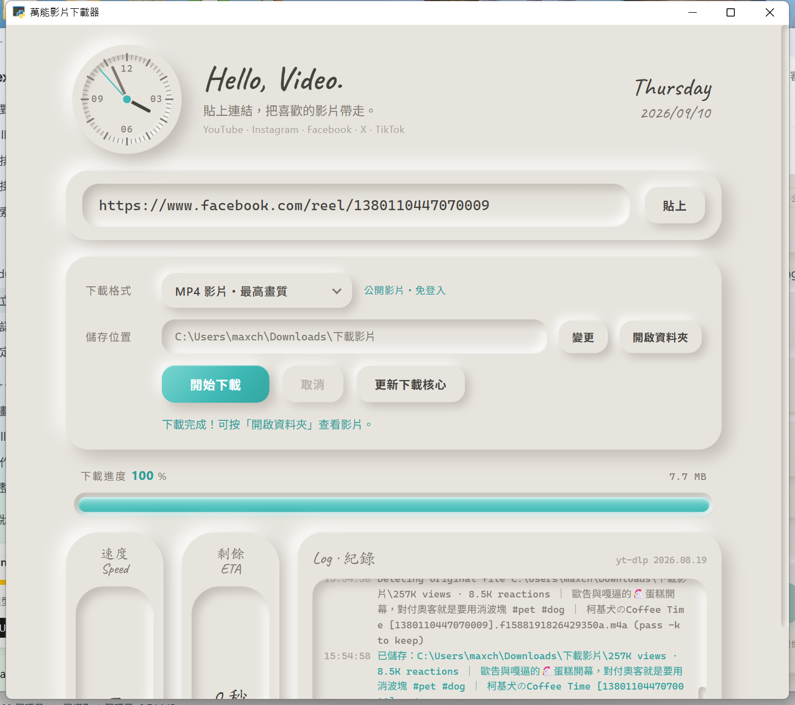

# 萬能影片下載器

貼上連結，把喜歡的影片帶走。支援 **YouTube · Instagram · Facebook · X · TikTok** 等上千個網站（由 [yt-dlp](https://github.com/yt-dlp/yt-dlp) 驅動），公開影片免登入、免廣告、直接最高畫質存到電腦。

介面採用柔和擬物（Soft UI / Neumorphism）風格：米灰底、雙向柔影、凹陷顯示區、青綠強調色與手寫字標題。



## 功能

- 貼上網址一鍵下載（「貼上」按鈕會自動從剪貼簿抓出網址）
- 四種格式：`MP4 最高畫質`、`MP4 1080p 以下`、`MP4 720p 以下`、`MP3 音訊`
- 同解析度優先挑 h264 / aac，Windows 內建播放器直接能放；4K 影片仍維持 4K
- 即時進度條、速度、剩餘時間、檔案大小、詳細紀錄
- 可隨時取消，儲存位置可更換並一鍵開啟資料夾
- 「更新下載核心」一鍵把 yt-dlp 升到最新版（網站改版時按這個通常就好）
- ffmpeg 內建（透過 `imageio-ffmpeg`），影音合併與轉 MP3 開箱即用

## 安裝與執行（Windows）

1. 安裝 [Python 3.11 以上](https://www.python.org/downloads/)，安裝時勾選 **Add python.exe to PATH**。
2. 下載或 `git clone` 這個專案。
3. 雙擊 **`run.bat`**。第一次會自動建立虛擬環境並安裝套件（約一分鐘），之後直接開啟視窗。

> 出問題時改跑 `debug.bat`，會顯示主控台訊息與開發者工具。

### 打包成免安裝 exe（選用）

- **單檔版**：雙擊 `build_onefile.bat`，產生 `dist\VideoDownloader-portable.exe`（約 130 MB），一個檔案丟到隨身碟或任何 Windows 10/11 電腦雙擊即可，不用裝 Python。每次開啟要先解壓到暫存區，啟動慢個幾秒。
- **資料夾版**：雙擊 `build_exe.bat`，產生 `dist\VideoDownloader\`，整個資料夾複製到別台電腦使用，開啟速度快。

打包版無法線上升級 yt-dlp（平台改版時請重新打包），但「更新下載核心」仍會自動安裝 deno 到 exe 旁邊的 `bin\`。設定檔 `settings.json` 也會存在 exe 旁邊，方便隨身攜帶。

> 沒有付費程式碼簽章，別台電腦第一次開啟會被 Windows SmartScreen 攔下，按「其他資訊 → 仍要執行」即可。
> 程式圖示由 `assets\make_icon.py` 產生（需要 Pillow），打包腳本會自動處理。

## 使用

1. 複製影片頁面的網址，回到程式按「貼上」。
2. 選好格式與儲存位置（預設 `下載\下載影片`）。
3. 按「開始下載」，完成後按「開啟資料夾」。

檔名格式為 `影片標題 [影片ID].mp4`。

## 進階設定

程式資料夾內的 `settings.json`（第一次執行後自動產生）：

```json
{
  "save_dir": "C:\\Users\\you\\Downloads\\下載影片",
  "format": "best",
  "cookies_from_browser": null
}
```

- `cookies_from_browser`：碰到需要登入才能看的影片（例如部分 Instagram、X 貼文），可設成 `"firefox"`，程式會借用該瀏覽器已登入的 cookies。Chrome / Edge 因 cookie 加密機制通常無法讀取。
- 想用自己的 ffmpeg：把 `ffmpeg.exe` 放進 `bin\` 資料夾即可優先使用。

## 專案結構

```
app.py            視窗殼層（pywebview + WebView2）、JS API、設定、剪貼簿、核心更新
downloader.py     yt-dlp 包裝：格式選擇、ffmpeg 定位、進度／取消、錯誤翻譯
ui/index.html     版面
ui/style.css      Soft UI 主題
ui/app.js         前端邏輯（在一般瀏覽器開啟會進入預覽模式，用假資料跑一次下載流程）
run.bat           一鍵啟動（自動建 .venv、裝套件）
debug.bat         除錯模式
build_exe.bat     PyInstaller 打包
```

## 注意事項

- 請只下載你有權利保存的內容，並遵守各平台的使用條款。
- 平台改版後若下載失敗，先按「更新下載核心」再試。
